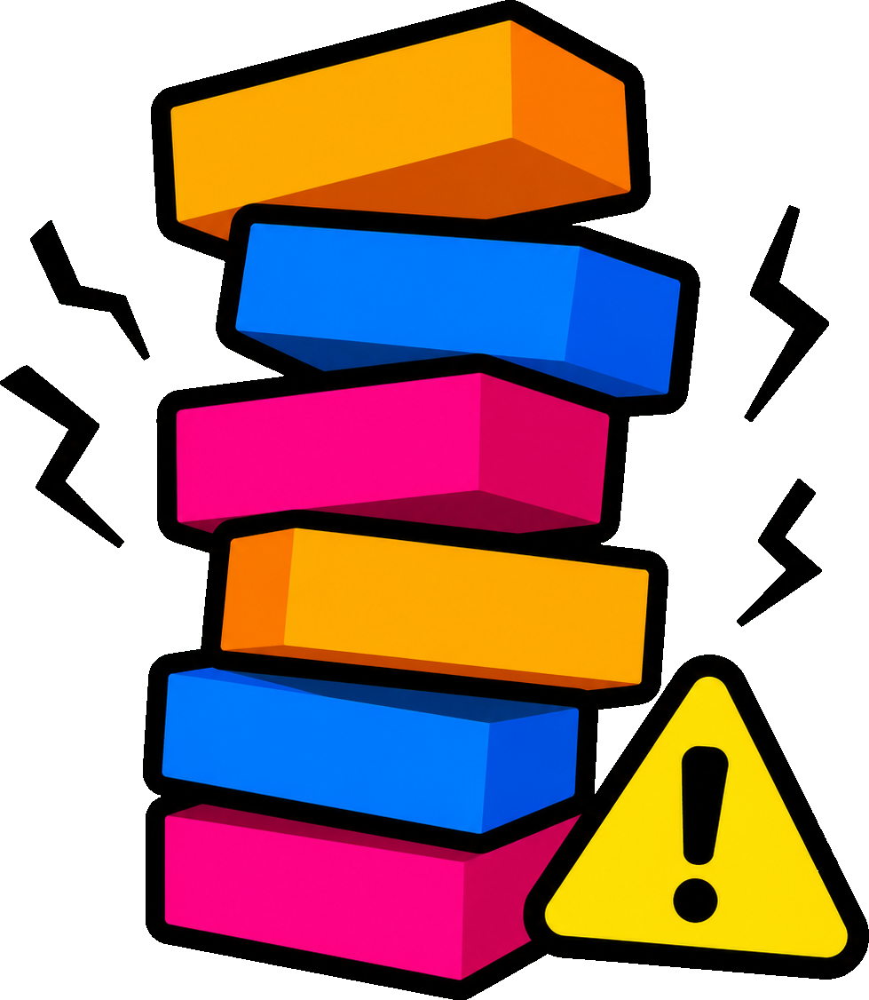
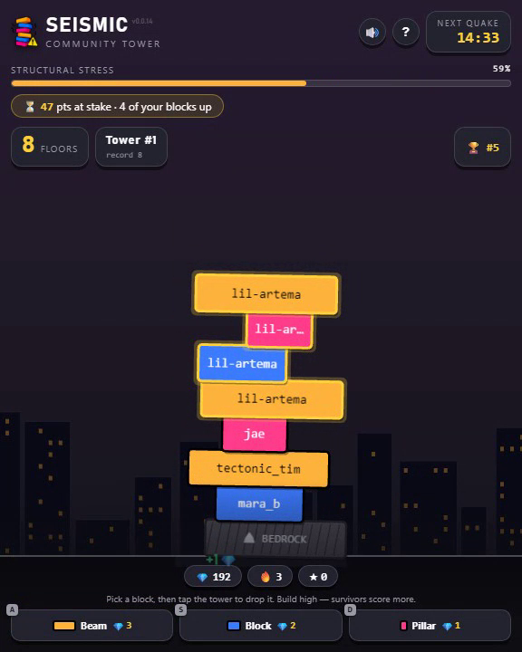
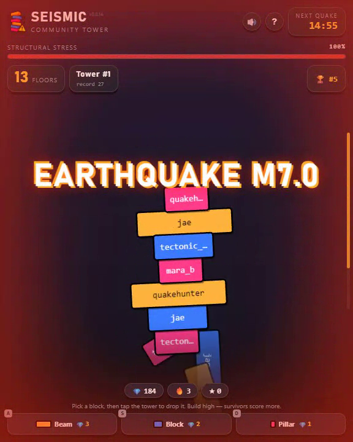
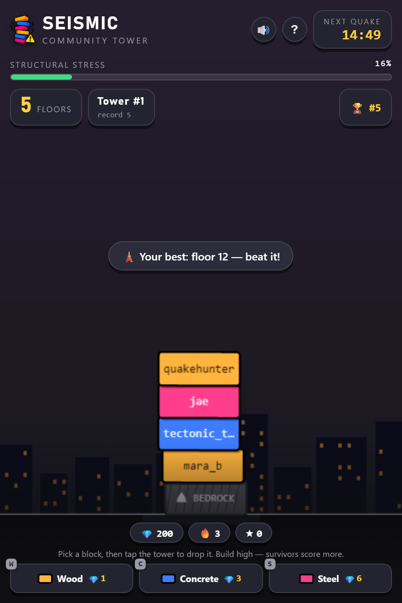

<div align="center">



# SEISMIC

### One tower. The whole community. An earthquake nobody controls.

**Stack a block — then pray it survives the quake.**

Built for Reddit's *Games with a Hook* hackathon on **Devvit Web** + **Phaser 4**.

</div>

---

## 🎬 Demo

▶️ **[`demo/seismic-demo.mp4`](demo/seismic-demo.mp4)** — 50‑second narrated walkthrough.

<div align="center">



</div>

---

## The hook

Most Reddit games drop you into a post, **alone**. Seismic does the opposite: it puts the **entire subreddit on one shared tower**.

You drop a single block with your name on it and choose *where* — safe near the base, or leaning out over the edge for more points and more risk. Everyone's blocks, one growing tower, climbing from the city streets all the way to space.

Then, at a time **nobody controls**, an **earthquake** strikes. The server decides — fairly, for everyone at once — which blocks survive and which come crashing down, floor by floor. Survive, and you score by how high your block stood.

**The hook is the wait.** You place your block and leave. The quake comes whether you're watching or not. You come back to a top‑of‑thread **aftershock report**, a **flair** on your best climb, and a daily **streak** pulling you in. It's asynchronous, community‑scale tension that's native to how Reddit actually works.

> **Stack a block. Survive the quake. Come back tomorrow.**

---

## How it plays

1. **Pick a shape and tap the tower** — you're building the one shared community tower.
2. **Aim by dragging** the ghost block left/right (touch or mouse), then release to drop it.
3. **Survive the earthquake** — blocks that are still standing score you points ★.

### Three shapes, not materials

What matters is **width** — because the block *below* you is the platform you rest on.

| Shape | Width | Cost | Role |
|-------|-------|------|------|
| ▬ **Beam** | wide (1.6×) | 💎 3 | A stable platform. Land a beam and you can build risky things on top of it. |
| ■ **Block** | standard | 💎 2 | The everyday workhorse. |
| ▮ **Pillar** | narrow (0.74×) | 💎 1 | Almost no margin — risky, but the cheapest and it pays the most. |

Cost scales with size (bigger piece = more material), which keeps the ultra‑stable beam from being spammed — so **shape stays a real decision**, and the pieces genuinely combine (wide base → narrow risky top).

### Risk is the reward

Points for a surviving block = **its height (floor) × how far it leaned out**. A block stacked dead‑center scores the bare minimum; one that leans over the edge **and survives** pays up to ~2× more. Playing it safe in the center is a *losing* strategy — which is what keeps the tower interesting.

### The bedrock

Every tower starts on a system‑owned **⛰ Bedrock** beam that belongs to nobody and scores for nobody — so being *first* is no longer a free, guaranteed point.

### Mini‑tremors

Between the big quakes, small tremors nudge the upper blocks off‑center over time. A "perfectly safe" centered tower never stays safe — it slowly leans until the next quake finds it. The ground is never still.

---

## The earthquake (the star)

<div align="center">

</div>

- **Server‑authoritative & fair.** The magnitude is derived from a seeded RNG, and the collapse is resolved on the server for everyone at once — no client can cheat the outcome.
- **Physically grounded.** A quake shrinks every joint's tolerated support (an additive lateral model). The tower snaps at the lowest failing joint; everything above it topples.
- **Never a cheap wipe.** Damage is capped and scales with magnitude, so a tall, well‑built tower keeps a real base — only the biggest quakes level everything.
- **Cinematic.** ~5 seconds of escalating shake, a slam‑in Richter banner, dust, and a camera that pans **down the collapse block by block**. Placement is locked while it plays.
- **Automatic, always.** Quakes fire on a scheduled job (exact time) with a once‑a‑minute server cron as a fail‑safe — they happen with **zero players online**.

When the dust settles, notable quakes post a top‑of‑thread **aftershock comment** (`⚡ Aftershock — M7.2 · 40 floors fell, u/you survived at floor 31`), award a **🗼 Floor N flair** on new personal bests, and start a fresh **Tower #N** when one fully collapses.

---

## Why it's sticky (retention by design)

- **Asynchronous tension** — place and leave; the payoff happens on its own timer.
- **Return report** — "while you were away: 3 quakes struck, you lost 2 blocks, earned +18."
- **Daily streaks** — up to +70 credits/day for coming back.
- **Watch‑to‑earn** — a small credit trickle just for actively watching the tower (visible‑tab only, daily‑capped).
- **Flairs & a live survivors leaderboard** — social proof baked into the subreddit.

---

## Architecture

Everything that matters is **server‑authoritative**. The client is a renderer; the server owns the truth.

```
┌────────────── Reddit / Devvit Web ──────────────┐
│                                                  │
│  Webview (Phaser 4)          Server (Hono)       │
│  ├─ splash.html  ──────────► GET  /api/init      │
│  └─ game.html                GET  /api/state     │
│      ├─ scenes/Game.ts       POST /api/place     │
│      ├─ hud.ts               POST /api/watch     │
│      └─ audio.ts             GET  /api/leaderboard│
│                                                  │
│  Scheduler                   Redis (state)       │
│  ├─ job: quake (exact time)  ├─ tower (zset)     │
│  └─ cron: tick (1 min)       ├─ credits/score    │
│                              └─ epochs, streaks  │
└──────────────────────────────────────────────────┘
        shared/model.ts — the single source of truth
        for the stacking + collapse physics, used by
        BOTH client (risk preview) and server (resolve)
```

### Concurrency & correctness

- **The tower is a Redis sorted set** — blocks are appended atomically (`incrBy` sequence + `zAdd`), so simultaneous placements never corrupt state or race.
- **Credits use atomic `incrBy`** — no double‑spend.
- **A per‑post lock** serializes the read‑check‑append in `/place`; the quake resolution is lock‑guarded so it can never run twice for the same event.
- **Deadlines advance before scheduling** — the next quake time is persisted *first*, so a flaky scheduler call can never cause back‑to‑back quakes.

### Tech stack

| | |
|---|---|
| Platform | [Devvit Web](https://developers.reddit.com/) `0.13.5` (Reddit's dev platform) |
| Game engine | [Phaser](https://phaser.io/) `4.2.0` |
| Server | [Hono](https://hono.dev/) on Devvit's Node runtime |
| State | Redis (sorted sets, hashes, atomic counters) |
| Scheduler | `@devvit/web` scheduler (one‑off jobs + cron) |
| Build | [Vite](https://vite.dev/) `8` + TypeScript `6` |
| Audio | Synthesized WebAudio (no asset files — CSP‑friendly) |

---

## Project structure

```
src/
├─ shared/
│  ├─ model.ts        # PURE physics: shapes, stacking, stress, resolveQuake, scoring
│  └─ api.ts          # request/response + PublicState types (client↔server contract)
├─ server/
│  ├─ index.ts        # Hono app + route wiring
│  ├─ core/
│  │  ├─ state.ts     # Redis data layer (tower, credits, score, streaks, tremors, watch)
│  │  ├─ quake.ts     # scheduling + authoritative quake resolution + rewards/flair/comment
│  │  ├─ post.ts      # custom post creation
│  │  └─ keys.ts      # central Redis key registry
│  └─ routes/
│     ├─ api.ts       # /init /state /place /watch /leaderboard
│     ├─ menu.ts      # moderator menu actions (create post, seed demo, force quake)
│     ├─ scheduler.ts # quake job + 1‑min cron backstop
│     └─ triggers.ts  # app install
└─ client/
   ├─ splash.html/.ts # post preview (video background + countdown + CTA)
   ├─ game.html/.css  # game shell + HUD
   ├─ scenes/Game.ts  # Phaser scene: rendering, input, camera, collapse cinematics
   ├─ hud.ts          # HUD, toasts, dock, leaderboard, onboarding
   ├─ net.ts          # typed API client
   └─ audio.ts        # synthesized SFX
```

---

## Running it

> Requires **Node 22+** and a Reddit account connected to [Reddit Developers](https://developers.reddit.com/).

```bash
npm install
npm run login      # authenticate with Reddit (devvit login)
npm run deploy     # type-check + lint + upload + install to your dev subreddit
```

Then, in your subreddit:

1. **`...` menu → "Create a Seismic tower post"** — spins up the game post.
2. Open the post and hit **Enter the tower**.
3. *(Optional, mods)* **"🌱 Seed a demo tower"** to populate it, and **"⚡ Force a quake now"** to trigger one on demand.

### Scripts

| Script | What it does |
|--------|--------------|
| `npm run deploy` | type-check → lint → `devvit upload` → `devvit install` (goes live) |
| `npm run build` | Vite build (client + server bundles) |
| `npm run type-check` | `tsc --build` |
| `npm run lint` | ESLint over `src` |
| `npm run login` | `devvit login` |

---

## Design notes

A few deliberate choices worth calling out:

- **"Arcade Brut" look** — a dark space‑climb backdrop with vivid amber/blue/magenta blocks and a bold condensed display face. Intentional and specific, not a template.
- **One physics model, two consumers** — `shared/model.ts` is pure and I/O‑free, so the client previews *exactly* the risk the server will resolve. The stress meter you see is the truth.
- **No audio assets** — every sound is synthesized in `audio.ts` (WebAudio), keeping the bundle tiny and CSP‑clean.
- **Fail‑safe by construction** — quakes fire even with nobody online; deadlines advance before scheduling; all mutations are atomic.

---

<div align="center">

**SEISMIC** · one tower · the whole community · an earthquake nobody controls

</div>
